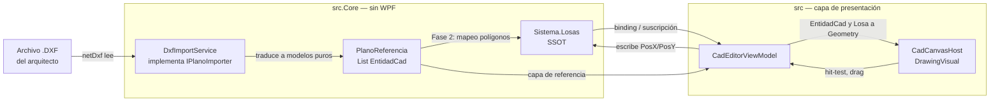
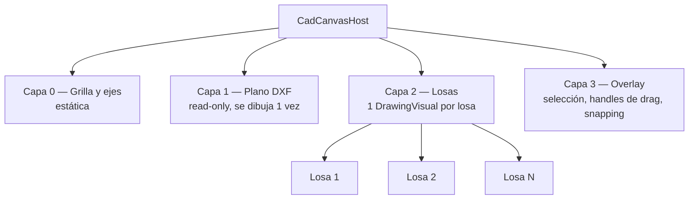
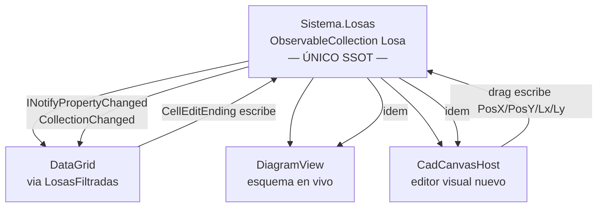

> ⚠️ Estado real autogenerado → ver [/STATE.md](STATE.md) (este documento puede estar desactualizado).

# PLAN_CAD_V1 — Editor visual CAD + importador DXF

> Documento de arquitectura para la visión **v1.0** de LosasPlus.
> Estado: **propuesta** · Fecha: 2026-05-18 · Versión del repo al planear: `v0.6.0` (`82e55fa`).
> Este documento **no contiene código de implementación** — define la
> arquitectura, las decisiones técnicas y el plan de 3 fases.

---

## 1. Resumen ejecutivo

### Objetivo

Llevar a LosasPlus de un editor **tabular** (DataGrid) a un editor **espacial**
tipo CAD, con dos capacidades nuevas:

1. **Importador de planos** — leer un archivo `.DXF` del arquitecto y mostrar
   su geometría como capa de referencia bajo las losas.
2. **Editor visual** — dibujar, mover y redimensionar losas directamente sobre
   un lienzo, con el mismo modelo que hoy alimenta el DataGrid.

### Alcance del MVP (v1.0)

| Incluye | NO incluye (futuro) |
|---|---|
| Lectura de `.DXF` (ASCII y binario) | Lectura de `.DWG` (ver §3.4) |
| Entidades: LINE, LWPOLYLINE, POLYLINE, TEXT, MTEXT, CIRCLE, ARC | Bloques anidados, hatches, dimensiones cotas |
| Visualización read-only del plano | Edición del plano DXF importado |
| Mapeo de polígonos rectangulares → `Losa` | Reconocimiento de polígonos irregulares |
| Crear / mover / redimensionar losas en el lienzo | Acotado paramétrico, capas múltiples editables |
| Exportar el lienzo a PNG (ya existe) | Exportar a `.DXF` |

### Principio rector

**Un único Single Source of Truth (SSOT): `Sistema.Losas`.** El lienzo CAD es
una *vista más* sobre la misma colección que el DataGrid y el `DiagramView`
actual — nunca un estado paralelo.

---

## 2. Estado actual del renderizado (auditoría)

Hoy LosasPlus ya dibuja un esquema 2D, pero con una técnica que **no escala**.

| Aspecto | Implementación actual | Archivo:línea | Veredicto |
|---|---|---|---|
| Técnica de dibujo | `Canvas` + `UIElement` Shapes | `src/Views/DiagramView.xaml.cs` (`Redraw`) | ❌ ~20-30 UIElements por losa |
| Estrategia de refresco | `Canvas.Children.Clear()` + redibujo total | `DiagramView.xaml.cs` (`Redraw`) | ❌ O(N) en cada cambio |
| Posición de losas | Inferida por `LayoutSolver.Solve()` (BFS) | `src.Core/Services/LayoutSolver.cs` | ⚠️ no persistida |
| Zoom / Pan | `TransformGroup` (Scale + Translate) sobre el Canvas | `DiagramView.xaml.cs` | ✅ correcto, se conserva |
| Hit-testing | `Rectangle` transparente (hitbox) por losa | `DiagramView.xaml.cs` (`DrawLosa`) | ⚠️ funciona, pero O(N) UIElements |
| Captura imagen | `RenderTargetBitmap` + `PngBitmapEncoder` | `DiagramView.xaml.cs` (`CaptureCanvasPng`) | ✅ se conserva |

**Conclusión:** con 100-300 losas el árbol visual tendría 2 000-9 000
`UIElement`, cada uno con layout/measure/arrange propio. El editor CAD necesita
**retained-mode rendering** (`DrawingVisual`) — ver §5.

El `LayoutSolver` actual es valioso y **se conserva**: queda como *fallback*
cuando una losa no tiene posición explícita (§4.3).

---

## 3. Decisión 1 — Estrategia de importación DXF/DWG

### 3.1 Comparativa de librerías open-source

| Criterio | **netDxf** | **IxMilia.Dxf** |
|---|---|---|
| Licencia | MIT | MIT |
| Target | netstandard2.0 → compatible .NET 8 | netstandard2.0 / net8.0 |
| Madurez / comunidad | Alta — años en producción, muy usada | Media — parte de la familia IxMilia |
| Cobertura de entidades | Muy amplia (LINE, polilíneas, TEXT/MTEXT, INSERT, HATCH, DIMENSION…) | Amplia, suficiente para el MVP |
| Dependencia de WPF/UI | **Ninguna** — usa tipos propios `Vector2`/`Vector3` | Ninguna |
| Lectura DXF binario | Sí | Sí |
| Peso | Liviano (un assembly) | Liviano |

### 3.2 Recomendación: **netDxf**

Se elige **netDxf** como librería primaria:

- **MIT** — sin trabas de licenciamiento.
- **netstandard2.0** — la referencia se puede agregar a `src.Core` sin
  contaminar nada (no arrastra WPF).
- **Madurez** — mejor cobertura de LWPOLYLINE/POLYLINE y de variantes de DXF
  que produce AutoCAD, Civil 3D y Revit al exportar.
- El **patrón Adapter** (§3.5) aísla la librería: si en el futuro se cambia a
  IxMilia.Dxf, solo se reescribe una clase.

`IxMilia.Dxf` queda documentada como **alternativa de contingencia** — misma
licencia, misma capacidad para el MVP.

### 3.3 Alcance del MVP — entidades soportadas

El importador del MVP traduce únicamente:

| Entidad DXF | Se traduce a | Uso |
|---|---|---|
| `LINE` | `EntidadCad.Linea` | Muros, ejes, contornos |
| `LWPOLYLINE` / `POLYLINE` | `EntidadCad.Polilinea` | Contornos de ambientes / losas candidatas |
| `TEXT` / `MTEXT` | `EntidadCad.Texto` | Rótulos, nombres de ambiente |
| `CIRCLE` / `ARC` | `EntidadCad.Arco` | Columnas, detalles |

Todo lo demás (hatches, bloques, cotas) **se ignora silenciosamente** en el
MVP — el plano se usa como *calco de referencia*, no como modelo editable.

### 3.4 Por qué se descarta `.DWG` del MVP

`.DWG` es un formato **binario propietario de Autodesk**, sin especificación
pública estable. Las opciones para leerlo son:

- Librerías comerciales (Open Design Alliance / Teigha) — **licencia de pago**.
- Conversión previa con el **ODA File Converter** (gratuito) `.DWG → .DXF`.

**Decisión:** el MVP soporta solo `.DXF`. Para usuarios con `.DWG`, el
documento de ayuda indicará: "exportá tu plano como DXF desde AutoCAD/Revit, o
convertilo con ODA File Converter". Esto evita *bloatware*, dependencias
pesadas y problemas de licencia. El soporte `.DWG` nativo queda como ítem
explícito de backlog post-v1.0.

### 3.5 Patrón Adapter — aislamiento de la librería

```
IPlanoImporter            (interfaz en src.Core)
   └── DxfImportService   (implementación con netDxf)
```

`src.Core` define la interfaz `IPlanoImporter` y los modelos de dominio. La
implementación `DxfImportService` es la **única** clase que conoce netDxf.
Cambiar de librería = reescribir una sola clase, sin tocar UI ni modelo.

---

## 4. Decisión 2 — Modelo de datos y traducción a `src.Core`

### 4.1 Modelos puros nuevos en `src.Core` (sin WPF)

Para respetar la regla "cero dependencias de WPF en el Core", se agregan
modelos con coordenadas `double` planas — sin `System.Windows.Point`,
sin `Geometry`:

```
src.Core/Models/Cad/
  PlanoReferencia      — el plano DXF importado completo
  EntidadCad           — clase base abstracta
    ├── LineaCad       { X1,Y1, X2,Y2, Capa }
    ├── PolilineaCad   { Puntos: List<PuntoCad>, Cerrada, Capa }
    ├── TextoCad       { X,Y, Contenido, Altura, Rotacion, Capa }
    └── ArcoCad        { Cx,Cy, Radio, AnguloInicio, AnguloFin, Capa }
  PuntoCad             { X, Y }   — struct liviano, NO System.Windows.Point
```

`PlanoReferencia` además guarda: nombre del archivo, **unidades del DXF**
(`$INSUNITS`), y el *bounding box* global. Las unidades son críticas — un DXF
puede venir en mm, cm o m (ver §8, riesgo de unidades).

### 4.2 Servicio de importación

`src.Core/Services/DxfImportService.cs` — implementa `IPlanoImporter`:

```
PlanoReferencia Importar(string rutaDxf)
```

- Usa netDxf para leer el documento.
- Recorre las entidades soportadas (§3.3) y las traduce a `EntidadCad`.
- Normaliza unidades a **metros** (la unidad interna del modelo de losas).
- Es una función pura de I/O — sin estado, testeable con fixtures `.dxf`.

`netDxf` no depende de WPF, así que `src.Core` puede referenciarlo sin
romper su independencia de UI.

### 4.3 Extensión del modelo `Losa` — posición opcional

Hoy `Losa` tiene `Lx`/`Ly` pero **no** posición. Se agregan **dos campos
opcionales** (en el `partial` de `Sistema.MemoriaPlus.cs`, para no tocar el
núcleo histórico):

```
Losa.PosX : double?     — coordenada X de la esquina sup-izq (m); null = sin posición
Losa.PosY : double?     — coordenada Y; null = sin posición
Losa.TienePosicionExplicita => PosX.HasValue && PosY.HasValue
```

**Coexistencia con `LayoutSolver`** — el resolvedor de posiciones se vuelve
*híbrido*:

- Si la losa **tiene** `PosX/PosY` → el lienzo usa esa posición tal cual.
- Si **no** la tiene → `LayoutSolver.Solve()` la infiere por adyacencias
  (comportamiento actual, intacto).

Esto preserva 100% de la compatibilidad: los `.lpx.json` y `.DL` existentes
(sin posición) siguen funcionando vía el solver. El editor CAD, al mover una
losa, simplemente *materializa* su posición escribiendo `PosX/PosY`.

**Persistencia:** `ProyectoSerializer` (System.Text.Json) toma las propiedades
públicas automáticamente — `PosX/PosY` se guardarán en el `.lpx.json` sin
cambios en el serializador.

### 4.4 Flujo de datos DXF → Core → WPF



La conversión de `EntidadCad`/`Losa` (coordenadas `double`) a `Geometry`,
`Point` y `DrawingContext` de WPF ocurre **exclusivamente** en `CadCanvasHost`
y `CadEditorViewModel`, dentro de `src/`. El Core nunca ve un tipo de WPF.

---

## 5. Decisión 3 — Renderizado WPF escalable

### 5.1 Por qué `DrawingVisual` y no Canvas + Shapes

| Criterio | Canvas + Shapes (hoy) | **DrawingVisual + DrawingContext (propuesto)** |
|---|---|---|
| Modelo | Cada figura es un `UIElement` con layout/measure/arrange | Retained-mode; el compositor de WPF dibuja sin layout por figura |
| Costo por losa | ~20-30 `UIElement` | 1 `DrawingVisual` (con N instrucciones de dibujo internas) |
| 300 losas | ~6 000-9 000 `UIElement` → UI lenta | ~300-900 `DrawingVisual` → fluido |
| Refresco | `Children.Clear()` + redibujo total | Invalidación selectiva: solo el visual que cambió |
| Hit-testing | Hitbox `Rectangle` por losa | `VisualTreeHelper.HitTest` nativo contra los visuals |
| Estilo | Verbose en XAML/code-behind | `DrawingContext.DrawGeometry/DrawText/DrawLine` directo |

`DrawingVisual` es la API de **bajo nivel retained-mode** de WPF — la indicada
para CAD/diagramación. No requiere interop con DirectX ni librerías externas.

### 5.2 `CadCanvasHost` — host de los visuals

Un `FrameworkElement` custom que hospeda una colección de `DrawingVisual` y
expone hit-testing y transform:

```
CadCanvasHost : FrameworkElement
  - _visualChildren : VisualCollection
  - override VisualChildrenCount / GetVisualChild   (contrato del host)
  - HitTest(Point) → ElementoCad alcanzado
  - RenderTransform → zoom/pan (se reusa el enfoque actual de DiagramView)
```

### 5.3 Arquitectura por capas (visuals separados)

El lienzo se organiza en **capas independientes** — cada una un `DrawingVisual`
raíz con hijos. Esto permite invalidar una capa sin redibujar las otras:



- **Capa 1 (plano DXF):** se dibuja una sola vez al importar; rara vez cambia.
- **Capa 2 (losas):** un `DrawingVisual` por losa → al editar una losa se
  re-renderiza **solo ese visual**, no las 300.
- **Capa 3 (overlay):** los *handles* de redimensión, el rectángulo de
  selección y las guías de *snapping* viven acá; se redibuja con cada
  movimiento del mouse sin tocar las capas inferiores.

### 5.4 Interacción y rendimiento

- **Hit-testing:** `VisualTreeHelper.HitTest` sobre `CadCanvasHost` → devuelve
  el `DrawingVisual` bajo el cursor → se mapea a la `Losa` o `EntidadCad`.
- **Zoom/Pan:** mismo enfoque que el `DiagramView` actual — `ScaleTransform` +
  `TranslateTransform`, ahora aplicados al `CadCanvasHost`.
- **Invalidación selectiva:** mover/editar una losa → reconstruir solo su
  `DrawingVisual` (abrir su `DrawingContext`, redibujar, cerrar). El resto del
  árbol queda intacto.
- **Edición fluida:** durante un *drag*, solo se actualiza la Capa 3 (overlay);
  al soltar (`MouseUp`) se confirma el cambio en el modelo y se reconstruye el
  visual de la losa en la Capa 2.

El `DiagramView` actual **se conserva sin cambios** para el modo "esquema en
vivo" — el `CadCanvasHost` es un componente nuevo y separado. No hay regresión.

---

## 6. Decisión 4 — Gestión de estado MVVM / SSOT

### 6.1 El SSOT no cambia

`Sistema.Losas` (`ObservableCollection<Losa>` en `src.Core/Models/Sistema.cs`)
sigue siendo el **único** SSOT. El lienzo CAD se engancha igual que el
`DiagramView` ya lo hace hoy:

- Lee directamente de `vm.Sistema.Losas`.
- Se suscribe a `Sistema.Losas.CollectionChanged` (alta/baja de losas).
- Se suscribe a `Losa.PropertyChanged` de cada losa (edición de Lx/Ly/PosX/…).
- Al mutar, llama `PushUndoSnapshot()` **antes** del cambio (Undo/Redo reusado).

### 6.2 Tres vistas, un solo estado



Editar una losa en el lienzo y verla actualizarse en el DataGrid (y viceversa)
es **automático** — ambos observan la misma colección. No hay sincronización
manual ni riesgo de divergencia.

### 6.3 `CadEditorViewModel`

Nuevo ViewModel, hermano de los modos de la sidebar. Responsabilidades:

- Mantener referencia al `MainViewModel` (acceso al `Sistema` activo y al
  `PlanoReferencia` importado).
- Exponer comandos (`RelayCommand` / `RelayCommand<T>` ya existentes):
  `ImportarDxfCommand`, `CrearLosaCommand`, `EliminarLosaCommand`,
  `MapearPoligonoCommand`.
- Traducir gestos del lienzo (drag, click) en mutaciones del SSOT, siempre
  precedidas de `PushUndoSnapshot()`.
- **No** almacena una copia de las losas — solo opera sobre `Sistema.Losas`.

### 6.4 Undo/Redo

Sin trabajo nuevo: el mecanismo de snapshots JSON del `Proyecto` ya cubre
cualquier mutación. El editor CAD solo debe llamar `PushUndoSnapshot()` antes
de cada operación, igual que hace hoy `OnLosasCellEdited` en el DataGrid.

---

## 7. Plan de implementación — 3 fases incrementales

Cada fase es **entregable y segura por sí sola**: deja la app compilando,
con tests verdes, y sin romper lo existente.

### Fase 1 — Importar `.DXF` y visualizar (read-only)

**Objetivo:** ver el plano del arquitecto bajo las losas, sin tocar el modelo
de losas.

| Entregable | Detalle |
|---|---|
| Modelos Core | `PlanoReferencia`, `EntidadCad` y derivados, `PuntoCad` |
| `IPlanoImporter` + `DxfImportService` | Lectura DXF con netDxf, normalización a metros |
| Dependencia NuGet | `netDxf` en `src.Core` |
| `CadCanvasHost` | Host `DrawingVisual` con Capa 0 (grilla) + Capa 1 (plano) |
| Pestaña sidebar "Plano CAD" | Nuevo `ModoSidebar.PlanoCad` + comando "Importar DXF…" |
| Capa 2 (losas) read-only | Dibuja las losas usando posición de `LayoutSolver` (fallback) |

**Criterios de aceptación:**
- Importar un `.dxf` real → se ve la geometría a escala correcta.
- Zoom/pan fluido con el plano cargado.
- Los 488 tests siguen verdes; build 0 warnings.

**Tests:** `DxfImportServiceTests` con fixtures `.dxf` sintéticos (líneas,
polilínea cerrada, texto) — verifican conteo de entidades y conversión de
unidades.

### Fase 2 — Mapeo de polígonos DXF → objetos `Losa`

**Objetivo:** convertir un contorno rectangular del plano en una `Losa` real.

| Entregable | Detalle |
|---|---|
| `Losa.PosX` / `Losa.PosY` | Campos opcionales nuevos (§4.3) |
| `LayoutSolver` híbrido | Respeta posición explícita; infiere si falta |
| Detector de rectángulos | Identifica `PolilineaCad` cerrada de 4 lados ortogonales |
| Comando "Mapear polígono → Losa" | Click en un polígono del plano → crea `Losa` con Lx/Ly/PosX/PosY del *bounding box* |
| Persistencia | `PosX/PosY` se guardan en `.lpx.json` (automático) |

**Criterios de aceptación:**
- Click en un rectángulo del DXF → aparece una `Losa` nueva en el DataGrid y
  en el lienzo, alineada con el plano.
- Guardar y recargar el `.lpx.json` preserva las posiciones.
- Las losas sin `PosX/PosY` (proyectos viejos) siguen dibujándose vía solver.

**Tests:** round-trip de `PosX/PosY` en `PersistenceTests`; detección de
rectángulos en `DxfImportServiceTests`; `LayoutSolver` híbrido en
`LayoutSolverTests`.

### Fase 3 — Editor de dibujo manual

**Objetivo:** crear y editar losas directamente en el lienzo, sin DXF.

| Entregable | Detalle |
|---|---|
| Capa 3 (overlay) | Handles de redimensión, rectángulo de selección |
| Herramienta "Dibujar losa" | Arrastrar para crear una `Losa` nueva (Lx/Ly/PosX/PosY) |
| Mover / redimensionar | Drag de la losa o de sus handles → escribe el SSOT |
| Snapping | Ajuste a grilla y a bordes de losas vecinas |
| Creación de `BordeAdic` | Al quedar dos losas adyacentes, sugerir el borde de continuidad |

**Criterios de aceptación:**
- Dibujar 3 losas con el mouse → aparecen en el DataGrid con dimensiones
  correctas.
- Mover una losa en el lienzo actualiza el DataGrid en vivo (mismo SSOT).
- Undo/Redo revierte cada operación de dibujo.

**Tests:** lógica de snapping y de creación de `BordeAdic` por adyacencia
(pura, testeable en Core); el resto es interacción WPF (smoke manual).

---

## 8. Riesgos y mitigaciones

| Riesgo | Impacto | Mitigación |
|---|---|---|
| **Unidades del DXF** — el plano puede venir en mm, cm, pulgadas | Plano a escala 1000× equivocada | Leer `$INSUNITS` del DXF; si está ausente, diálogo "¿en qué unidad está este plano?" |
| **Polilíneas no rectangulares** — un ambiente con forma de L | El detector de rectángulos no las mapea | MVP solo mapea rectángulos ortogonales; las demás quedan como referencia visual. Backlog: subdivisión. |
| **DXF muy pesado** (planos de torre completos, 50 000+ entidades) | Render lento de la Capa 1 | La Capa 1 se dibuja una sola vez (estática); *culling* por viewport si hace falta. |
| **Regresión del `DiagramView` actual** | Romper el "esquema en vivo" | `CadCanvasHost` es **componente nuevo y separado**; `DiagramView` no se toca. |
| **Posición explícita vs solver** — conflicto entre `PosX/PosY` y adyacencias | Losa "salta" de lugar | Regla clara: si hay `PosX/PosY`, manda; el solver es solo fallback. Documentado y testeado. |
| **`.DWG` solicitado por usuarios** | Expectativa no cubierta | Mensaje claro en UI + ayuda: convertir a DXF. Backlog explícito. |

---

## 9. Apéndice

### 9.1 Archivos nuevos estimados

```
src.Core/Models/Cad/PlanoReferencia.cs
src.Core/Models/Cad/EntidadCad.cs            (clase base + derivados)
src.Core/Services/IPlanoImporter.cs
src.Core/Services/DxfImportService.cs
src/Views/Cad/CadCanvasHost.cs
src/Views/Cad/CadView.xaml (+ .cs)
src/ViewModels/CadEditorViewModel.cs
tests/LosasPlus.Tests/DxfImportServiceTests.cs
tests/LosasPlus.Tests/fixtures/*.dxf          (fixtures sintéticos)
```

### 9.2 Archivos modificados estimados

```
src.Core/Models/Sistema.MemoriaPlus.cs   — Losa.PosX / PosY (partial)
src.Core/Services/LayoutSolver.cs        — modo híbrido (respeta posición explícita)
src/ViewModels/MainViewModel.cs          — ModoSidebar.PlanoCad
src/MainWindow.xaml                      — pestaña sidebar + ContentControl
src.Core/LosasPlus.Core.csproj           — PackageReference netDxf
```

### 9.3 Dependencias NuGet a agregar

| Paquete | Proyecto | Licencia |
|---|---|---|
| `netDxf` | `src.Core` | MIT |

### 9.4 Impacto en los tests

- Los **488 tests** actuales no se ven afectados (el cambio es aditivo).
- Fase 1 suma `DxfImportServiceTests` (~8-10 tests).
- Fase 2 suma tests de `PosX/PosY` round-trip y detección de rectángulos.
- Fase 3 suma tests de snapping y de generación de `BordeAdic`.
- Meta: mantener **0 warnings** y la cobertura del Core.

### 9.5 Lo que este plan NO compromete

- No se toca el `DiagramView` ni el motor `Losas.exe`.
- No se implementa `.DWG`, exportación a DXF, ni hatches/bloques/cotas.
- El editor CAD es un **modo nuevo** — el flujo DataGrid sigue siendo el
  predeterminado y plenamente funcional.

---

*Fin de PLAN_CAD_V1. Próximo paso sugerido: aprobar el plan e iniciar la
Fase 1 (importador DXF + visualización read-only).*