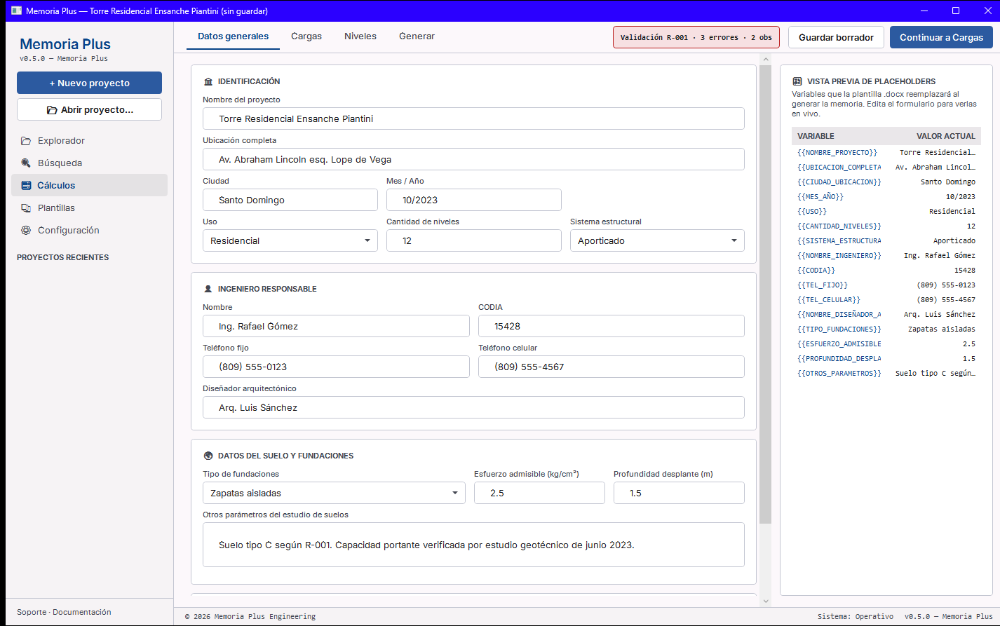
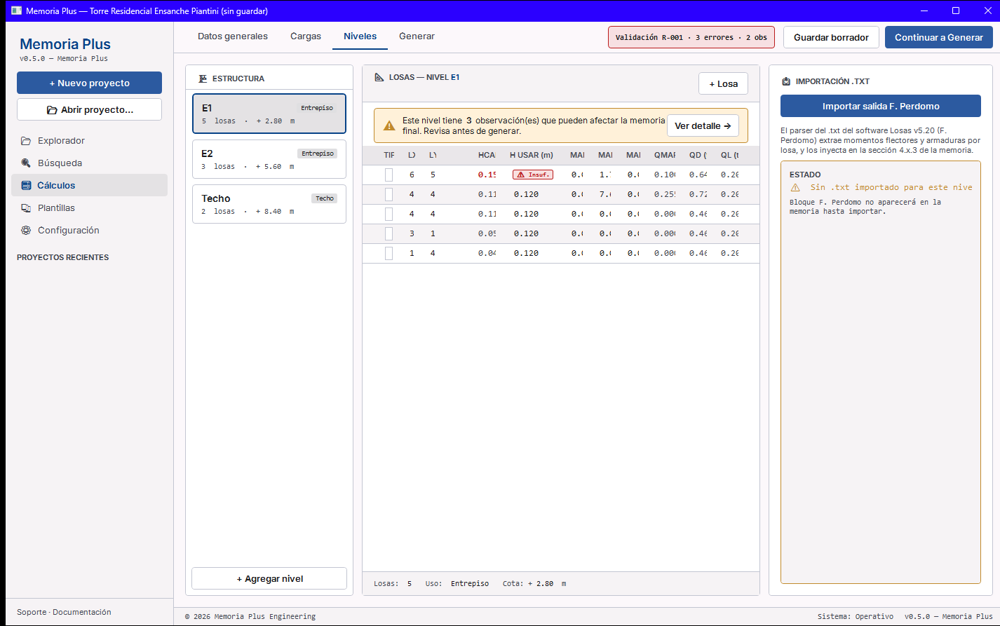
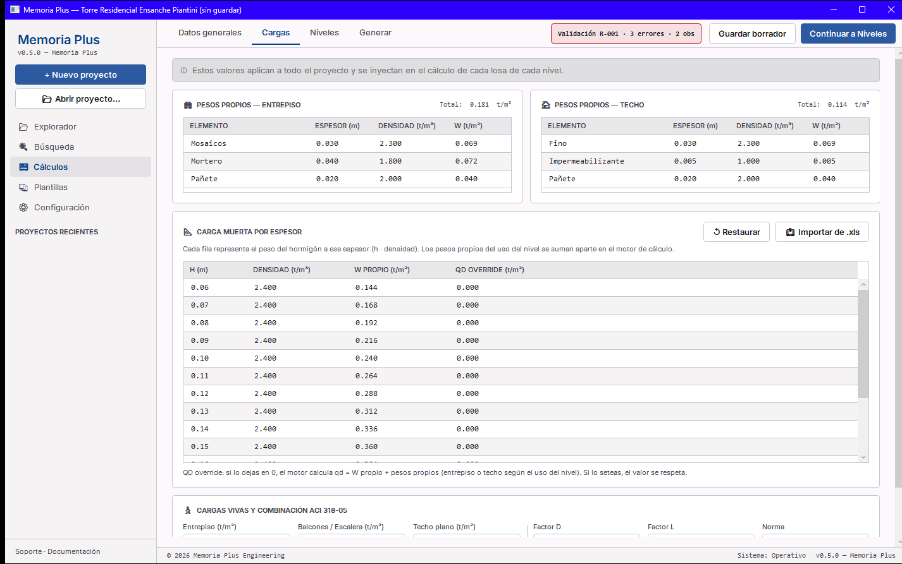
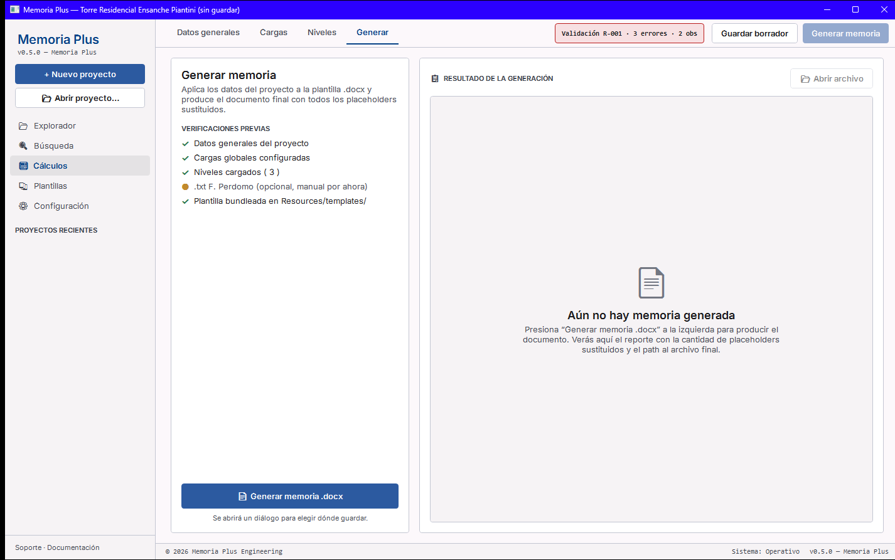
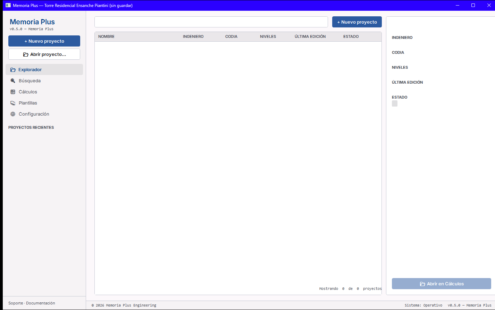
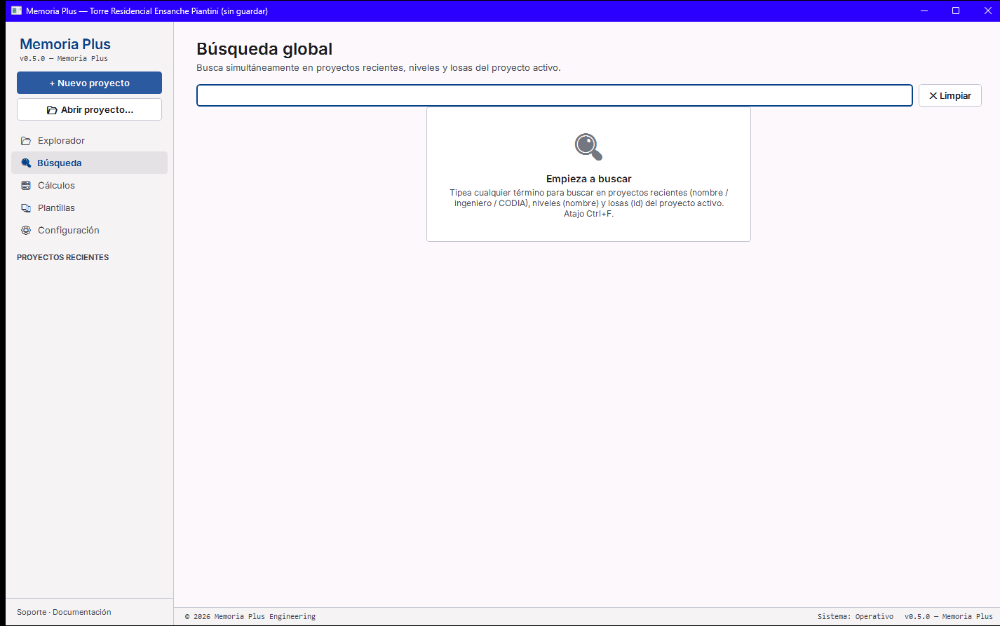
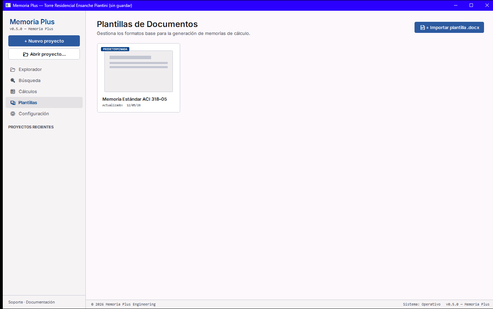
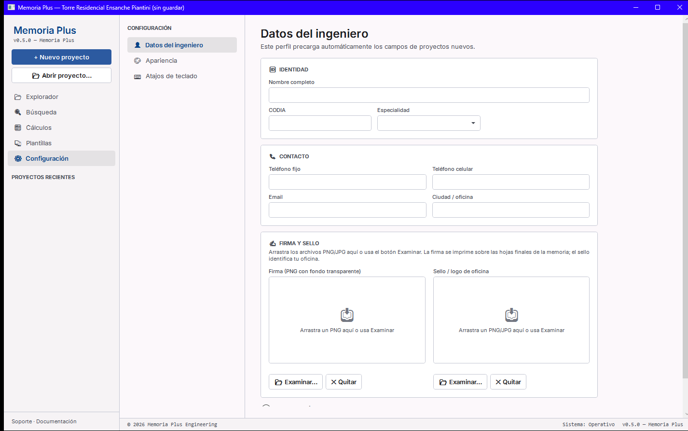

<h1 align="center">LosasPlus &nbsp;/&nbsp; MemoriaPlus</h1>

<p align="center">
  <b>Suite de diseño estructural en .NET 8 / Avalonia (multiplataforma: Linux · Windows · macOS) para ingenieros civiles dominicanos.</b><br/>
  Editor de losas con cálculo en vivo + vigas continuas + vista 3D + transmisión de cargas + generación automática de memoria de cálculo en formato <code>.docx</code>.<br/>
  Conforme a R-001, R-024 y ACI 318.
</p>

<p align="center">
  <a href="https://github.com/dashy2004/LosasPlus/actions/workflows/ci.yml"></a>
  <a href="https://github.com/dashy2004/LosasPlus/actions/workflows/release.yml"></a>
  <a href="LICENSE"></a>
  <a href="https://dotnet.microsoft.com/download/dotnet/8.0"></a>
  <a href="https://github.com/dashy2004/LosasPlus/releases"></a>
  
  
</p>

<p align="center">
  <a href="#instalación-rápida-usuario-final">Instalación</a> •
  <a href="#qué-hay-adentro">Estructura</a> •
  <a href="#capacidades-end-to-end-v04">Capacidades</a> •
  <a href="#roadmap">Roadmap</a> •
  <a href="#contribuir">Contribuir</a> •
  <a href="#licencia">Licencia</a>
</p>

---

> **Autor:** Emil Guillén De la Cruz · emilgdc@gmail.com ·
> GitHub [@dashy2004](https://github.com/dashy2004) ·
> YouTube [@emilguillen](https://www.youtube.com/@emilguillen) ·
> Instagram [@emilguillendelacruz](https://www.instagram.com/emilguillendelacruz)
>
> **Motor de cálculo `Losas.exe`** (usado opcionalmente por `LosasPlus.App`):
> propiedad de Ing. Francisco Eludino Perdomo (programa Losas v5.20, método
> Pieper-Martens). NO se redistribuye en este repo 

---

## 🐧 Port a Avalonia — multiplataforma (Linux · Windows · macOS)

La suite, originalmente **WPF (solo-Windows)**, fue portada a **Avalonia 11 / .NET 8**, con
**Linux como plataforma primaria de desarrollo** sin perder Windows ni macOS (Avalonia compila
para los tres). El motor de cálculo (`src.Core`) es puro y multiplataforma.

**Correr en Linux** (con el SDK .NET 8 en el `PATH`):

```bash
export PATH="$HOME/.dotnet:$PATH"
dotnet build LosasPlus.Linux.sln -c Debug          # compila toda la solución
dotnet run --project src        -c Debug           # LosasPlus (app principal)
dotnet run --project src.Memoria -c Debug          # MemoriaPlus (generador de memoria)
```

Guía detallada de build/publish/portado en **[`BUILD-Linux.md`](BUILD-Linux.md)**.

**Novedades del port (más allá de la paridad WPF):**

- **Lienzo CAD** (render inmediato Avalonia, importación de plano DXF + PDF underlay con PDFium).
- **Vigas continuas** con análisis por rigidez directa y diagramas **V(x) · M(x) · δ(x)** (OxyPlot).
- **Vista 3D** alámbrica del edificio **sin SharpDX** (proyección por software sobre el `DrawingContext`
  de Avalonia: cámara orbital, columnas y zapatas) — corre en Linux/Vulkan/OpenGL sin dependencia nativa.
- **Transmisión de cargas** (bajada **losa → viga → columna → zapata**): reparto por áreas tributarias,
  reparto geométrico real por posición en planta, acumulación por niveles y predimensionado de zapatas,
  con vista **Bajada de Cargas** (export a XLSX) y editor de **Columnas**.
- **Export SAF** (Structural Analysis Format) del modelo de vigas.

---

## Qué hay adentro

| Proyecto | Tipo | Qué hace |
|---|---|---|
| [`src.Core/`](src.Core/) | Librería `net8.0` | Modelo de dominio (Proyecto, Sistema, Losa, Cargas), parsers `.DL`/`.TXT`, motor de cálculo (espesor 1D/2D, qd, qu), generador de memorias `.docx`, importador de cargas Excel. **Sin dependencia de WPF** — reusable desde cualquier consumidor .NET. |
| [`src/`](src/) | App WPF (LosasPlus) | Editor + visor del archivo `.DL` que consume `Losas.exe` (Ing. F. Perdomo). Diagrama del sistema, importación del `.TXT` de salida, exportación a CSV/XLSX, sandbox de plugins en C# Script. |
| [`src.Memoria/`](src.Memoria/) | App WPF (MemoriaPlus) | Generador de memorias de cálculo `.docx`. Captura datos del proyecto, edita cargas globales, parsea salidas F. Perdomo, y genera la memoria final con plurinivel automático y tablas de momentos/armaduras. **Standalone** — no necesita `Losas.exe`. |
| [`tests/LosasPlus.Tests/`](tests/) | xUnit tests | **501 tests** cubriendo modelo, motor de cálculo (αfm ACI 9.5.3.3, espesor equivalente, cómputos, acero distribuido), validación normativa, catálogo estricto de tipos, registries de proyectos/plantillas/atajos/temas, configuración, generador de memorias, Doctor de archivos .DL, importador DXF, y todos los importers. |

---

## Captura

### Flujo principal — Cálculos (4 pestañas)

| Datos generales | Niveles + losas |
|---|---|
|  |  |

| Cargas globales | Generación |
|---|---|
|  |  |

### Modos top-level

| Explorador (hub de proyectos recientes) | Búsqueda global (proyectos / niveles / losas) |
|---|---|
|  |  |

| Plantillas (.docx CRUD) | Configuración (perfil + drag-drop firma/sello + atajos editables) |
|---|---|
|  |  |

---

## Capacidades end-to-end (v0.7)

**Cálculo estructural (ACI 318 + R-001):**
- ✅ Cond 1D / 2D automático según relación Ly/Lx; `h_calc` con fórmulas
  separadas (ACI 9.5.2.1 para 1D, ACI 9.5.3.2 para 2D).
- ✅ **αfm ACI 318 §9.5.3.3 completo**: `Iviga = b·h³/12`, `Ilosa` por
  franja, `αx`/`αy`/`αm` y estado `OK`/`CHK` (αm > 2) — la "tabla de
  espesor equivalente" del Excel del ingeniero portada y verificada.
- ✅ **Espesor equivalente vigueta+bloque** vía T-section (commit 27)
  con `VigaTipo` y `Bovedilla 1D/2D` configurables por proyecto.
- ✅ **Cómputos métricos por losa**: cantidad de bovedillas en X/Y,
  V_bovedilla, V_total, V_concreto. Listo para reportes de obra.
- ✅ **Refuerzo distribuido** por diámetro ASTM A615 (`#3..#8`) con
  áreas nominales (0.71, 1.27, 1.99, 2.85, 3.88, 5.07 cm²) y cálculo de
  `As` total por franja. UI dedicada **próximamente** en pestaña
  "Aceros" (Core listo + exportación operativa).
- ✅ Cargas: `q_mamp`, `q_map`, `q_d`, `q_l`, `q_u` con combinación
  factorizada ACI.

**Edición del proyecto:**
- ✅ Captura del proyecto con 17 placeholders documentados.
- ✅ Cargas globales editables en UI o importables del `.xlsx` del ingeniero.
- ✅ DataGrid de niveles con cálculo en vivo (todas las columnas anteriores).
- ✅ Importación de salida F. Perdomo (`.txt`) con parser de momentos y armaduras X/Y.
- ✅ **Salida `.txt` con dos vistas**: Texto con highlighting + Tabla editable
  estilo Excel (Ctrl+C copia con tabs); exportación a `{stem}.modificado.txt`
  sin pisar el archivo original.
- ✅ Selector visual de tipo de losa Pieper-Martens (26 tipos con iconos
  SVG del usuario + fallback programático).
- ✅ Direccionalidad H/V indicada con icono rotable según `Lx > Ly`.

**Persistencia y workflow:**
- ✅ Guardar/Abrir proyectos en formato `.lpx.json` con Ctrl+N/O/S/Shift+S.
- ✅ **Auto-backup**: cada save crea `{carpeta}/backups/{nombre}_{timestamp}.lpx.json`
  sin pisar el principal, con prune a 20 copias.
- ✅ Sección **"Proyecto activo"** en modo Explorador con TextBoxes
  editables para Nombre/Autor/Código + lista de sistemas renombrables
  in-place.
- ✅ Lista de proyectos recientes con filtro por nombre / ingeniero / CODIA.
- ✅ Búsqueda global Ctrl+F: filtra simultáneamente proyectos, niveles y losas.
- ✅ Atajos de teclado totalmente reasignables en vivo.
- ✅ Multi-select de losas (Ctrl/Shift + click) + panel bulk-apply
  para editar Lx/Ly/H/Carga/Tipo en lote.
- ✅ Undo/Redo (Ctrl+Z, Ctrl+Y) con snapshots JSON.

**🩺 Doctor de archivos .DL:**
- ✅ **Detecta 7 patrones de corrupción** típicos: JSON disfrazado de .DL
  (caso real reportado), BOM UTF-8/16, decimal con coma (es-DO desde
  Excel), IDs duplicados, geometría inválida, recubrimiento ≥ espesor,
  bordes huérfanos, balanceo no normalizado.
- ✅ **Auto-repara** los corregibles (decimal-coma, BOM) y exporta a
  `{stem}.reparado.DL` sin pisar el original.
- ✅ Modal con shading verde/amarillo/rojo por severidad + botón de
  acción contextual (abrir como proyecto si es JSON, aplicar
  reparación si hay fix, etc.).
- ✅ Se dispara automáticamente al fallar `Abrir .DL legacy…`.

**Validación normativa (R-001 + ACI 318):**
- ✅ Engine pluggable con 4 reglas: espesor mínimo R-001, carga viva mínima R-001, espesor vs cálculo ACI, aspecto Pieper-Martens.
- ✅ Chip indicador en el top bar (verde/naranja/rojo según severidad) clickable a panel lateral.
- ✅ Panel lateral con conteos + filtros + detalle de cada issue + auto-fix "Aplicar mínimo R-001".
- ✅ Badges in-grid en la columna H USAR + banner per-sistema en NivelesView.
- ✅ Copiar reporte plano al portapapeles.

**Configuración → Apariencia (aplica en vivo):**
- ✅ Tema Claro / Oscuro / Precision con persistencia en `%APPDATA%`.
- ✅ Tipografía monoespaciada seleccionable (JetBrains Mono, Iosevka,
  Consolas) que mutea `FontFamilyMono` global sin reiniciar.
- ✅ **8 swatches de color de acento** + entrada hex personalizada;
  click directo aplica el color a `Accent` / `AccentHi` / `PrimaryBrush`.
- ✅ **Presets nombrados** guardados en `%APPDATA%/LosasPlus/themes.json`
  con CRUD completo (Guardar como, Cargar, Eliminar).
- ✅ Sub-tab "Datos del ingeniero" oculto en LosasPlus (es responsabilidad
  de MemoriaPlus).

**Exportación de resultados (CSV / XLSX):**
- ✅ **31 columnas por losa** en CSV: input + Mfx/Mfy/MSx/MSy/AsxVano/AsyVano
  del motor + HCalc/HEq/Qd/Ql/Qu + αx/αy/αm/EstadoαFm + V_total/V_bov/V_con
  + N bovedillas + Asx_calc/Asy_calc.
- ✅ XLSX con hojas Resumen / Losas / **Verificación ACI** / Apoyos /
  Espejo .TXT / Esquema / Combinaciones. Filas con shading verde
  (αm OK) o rojo (CHK).
- ✅ Recálculo automático antes de exportar (no quedan outputs viejos).

**Generación de memoria:**
- ✅ "Generar memoria" en LosasPlus lanza `MemoriaPlus.exe` con el
  `.lpx.json` como argumento (handshake limpio sin duplicar lógica).
- ✅ MemoriaPlus genera `.docx` con sustitución robusta de placeholders
  (incluso fragmentados entre runs).
- ✅ Plurinivel: bloque NIVEL clonado por sistema vía markers `{{NIVEL_BLOQUE_INICIO/FIN}}`.
- ✅ Tablas embebidas: `{{TABLA_LOSAS}}`, `{{TABLA_MOMENTOS}}`, `{{TABLA_ARMADURAS_X/Y}}`, `{{TABLA_APOYOS}}`.

Convención de placeholders documentada en [`docs/referencia/README.md`](docs/referencia/README.md).

---

## Instalación rápida (usuario final)

Bajá la última release desde [Releases](https://github.com/dashy2004/LosasPlus/releases) y abrí cualquiera de las dos `.exe`. **No requiere instalar .NET ni nada más** — son ejecutables single-file self-contained (~180 MB cada uno).

- **Windows 10/11 x64.**
- Primer arranque tarda ~5 s mientras Windows extrae el runtime embebido.
- SmartScreen mostrará "Windows protegió tu PC" la primera vez (ejecutables sin firmar): *"Más información"* → *"Ejecutar de todas formas"*.

`LosasPlus.exe` necesita además que tengas tu copia legítima de `Losas.exe`
(Ing. F. Perdomo) en una carpeta accesible. `MemoriaPlus.exe` es totalmente
standalone.

---

## Compilar desde fuente (desarrolladores)

```bash
git clone https://github.com/dashy2004/LosasPlus.git
cd LosasPlus
dotnet restore
dotnet build LosasPlus.sln -c Release
dotnet test  LosasPlus.sln -c Release
```

Ejecutar en modo desarrollo:

```bash
dotnet run --project src/LosasPlus.csproj                # LosasPlus.App
dotnet run --project src.Memoria/MemoriaPlus.App.csproj  # MemoriaPlus.App
```

Empaquetar `.exe` distribuibles:

```bash
# LosasPlus
dotnet publish src/LosasPlus.csproj -c Release -r win-x64 \
  --self-contained=true -p:PublishSingleFile=true \
  -p:IncludeNativeLibrariesForSelfExtract=true

# MemoriaPlus (con plantilla embebida)
dotnet publish src.Memoria/MemoriaPlus.App.csproj -c Release -r win-x64 \
  --self-contained=true -p:PublishSingleFile=true \
  -p:IncludeAllContentForSelfExtract=true
```

Los `.exe` quedan en `src/bin/Release/...win-x64/publish/` y
`src.Memoria/bin/Release/...win-x64/publish/`.

---

## Estructura del repo

```
LosasPlus/
├── src.Core/                        # librería compartida (net8.0)
│   ├── Models/                      # Proyecto, Sistema, Losa, CargasGlobales, SalidaPerdomo
│   ├── Calculo/                     # CalculoEngine (h_calc, qmamp, qd, qu)
│   ├── Generation/                  # MemoriaGenerator + PlaceholderConstants
│   ├── Importers/                   # CargasGlobalesXlsxImporter
│   └── Services/                    # DLFileService, TxtParser, SalidaPerdomoAdapter, ...
├── src/                             # LosasPlus.App (WPF wrapper de Losas.exe)
├── src.Memoria/                     # MemoriaPlus.App (WPF generador de memorias)
├── tests/LosasPlus.Tests/           # 501 tests xUnit
├── tests/fixtures/                  # samples sintéticos para tests
├── docs/
│   ├── referencia/                  # plantilla genérica, xlsx demo, wireframes
│   └── RUNNER_BEHAVIOR.md           # por qué la ejecución del cálculo es manual
├── plugins/                         # ejemplos de plugins .csx para LosasPlus.App
└── ICONOS/                          # iconos del catálogo Pieper-Martens (24 tipos)
```

---

## Roadmap

**v0.5 — Completado ✅:**
- Persistencia de proyectos a `.lpx.json` + auto-backup.
- Pestaña Configuración con perfil del ingeniero + apariencia + atajos.
- Pestaña Plantillas (MemoriaPlus) con gestión múltiple de `.docx`.
- Validación R-001 / ACI 318 automática.

**v0.6 — Completado ✅:**
- αfm ACI 318 §9.5.3.3 con `VigaTipo` + `Bovedilla` configurables.
- Cómputos métricos por losa (volúmenes, cantidades de bovedilla).
- Doctor de archivos .DL con auto-reparación.
- Apariencia que aplica en vivo (tema, fuente, color de acento).
- Salida .TXT con dos vistas (Texto + Tabla editable).
- Exportador CSV/XLSX completo con hoja "Verificación ACI".

**v0.7 — Completado ✅:**
- Catálogo estricto de **23 tipos** de losa + validación fail-fast
  (parser .DL con remapeo de aliases, regla normativa, Doctor, celda
  marcada en rojo).
- **Importador DXF — Fase 1.A**: capa de dominio del editor CAD
  (`PlanoReferencia`, `EntidadCad`, `DxfImportService` con netDxf).
  Ver [`PLAN_CAD_V1.md`](PLAN_CAD_V1.md).

**v0.8 (próximo):**
- **Editor CAD Fase 1.B**: host visual WPF (`DrawingVisual`) para el
  plano DXF importado.
- **UI de Aceros** dedicada en la pestaña sidebar (hoy "próximamente"):
  As requerido vs As provisto en vivo, separación de barras adicionales
  por empalmes (ACI 318 §25.5), reportes por franja.
- Panel αfm visual en el Editor (chips OK/CHK + αx/αy/αm).
- Editores globales de `VigaPrincipal`, `Bovedilla1D/2D` en el panel
  lateral del Editor.

**v1.0 (3-6 meses):**
- Editor visual de losas — Fases 2 y 3 del plan CAD (mapeo
  polígono→Losa, editor de dibujo manual).
- Distribución vía installer MSI firmado.
- Locale `es-DO` con formatos numéricos dominicanos.

**v2.0 (visión 1+ año):**
- Suite con `VigasPlus`, `ColumnasPlus`, `FundacionesPlus`, `MurosPlus`,
  `EscalerasPlus` — todas alimentando una sola `MemoriaPlus`.
- Plugin para Revit (extraer modelo BIM directo).
- Marketplace de plantillas comunitarias.

---

## Contribuir

Issues y pull requests son bienvenidos. Para cambios grandes, abrí un issue
primero para discutir el diseño. La suite respeta convenciones .NET estándar
(C# 12, `Nullable=enable`, xUnit) y mantiene **0 warnings** en build.

```bash
dotnet test LosasPlus.sln  # debe quedar 501/501 verde antes de un PR
```

---

## Licencia

[MIT](LICENSE) — ver el archivo para los términos completos y las
**atribuciones a terceros** (especialmente `Losas.exe` del Ing. F. Perdomo,
que NO está cubierto por esta licencia y que el usuario debe obtener
directamente del autor).

---

## Agradecimientos

- **Ing. Francisco Eludino Perdomo** — autor del motor de cálculo Losas.exe
  sobre el que LosasPlus actúa como capa moderna sin modificar el binario
  original.
- **Comunidad ACI 318 y CODIA RD** — referencias normativas usadas en el
  motor de cálculo y la validación.
