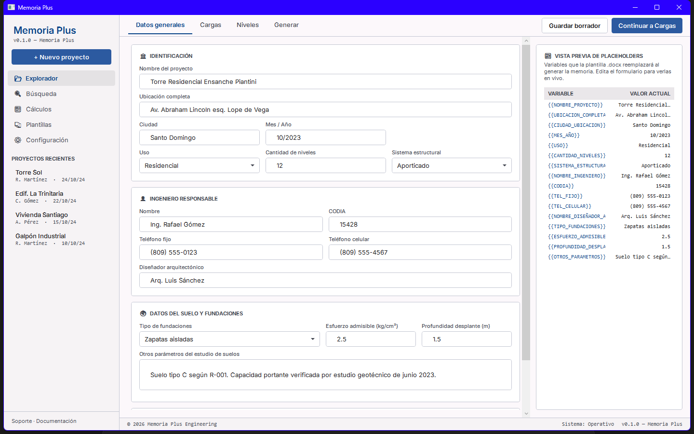
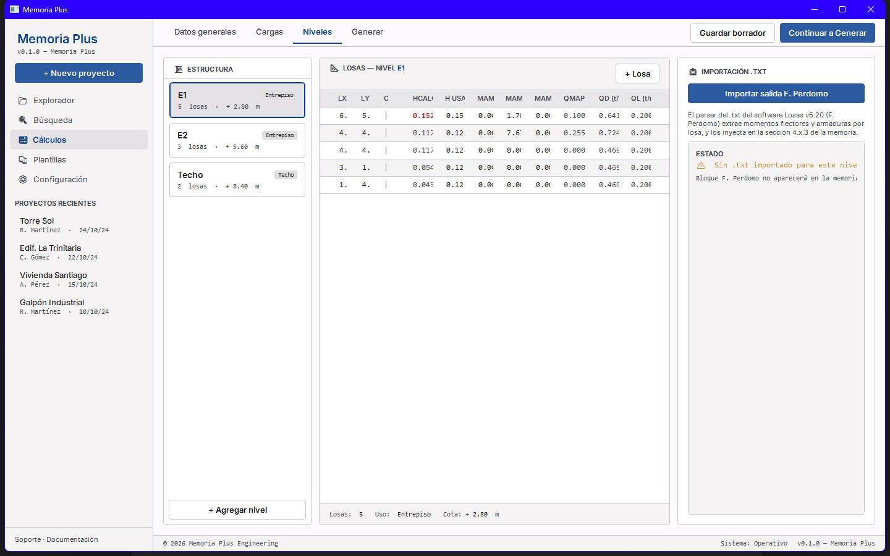
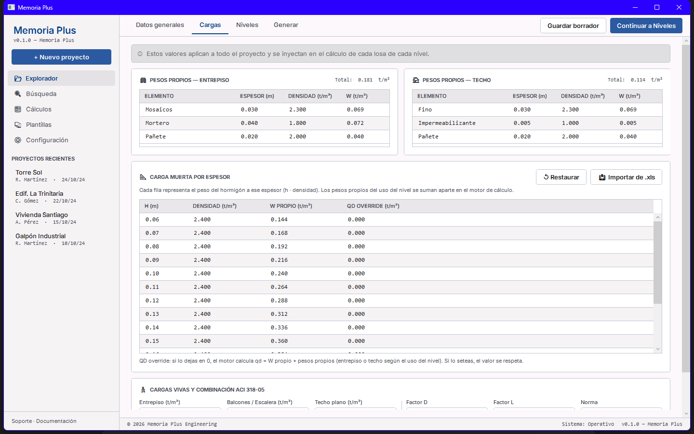
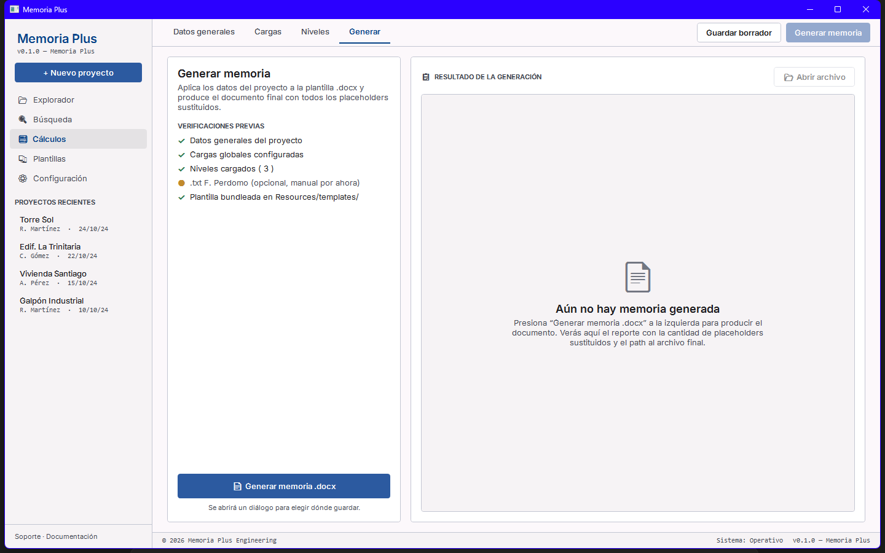

# LosasPlus / MemoriaPlus

Suite de herramientas de diseño estructural en .NET 8 / WPF, pensadas para
ingenieros civiles de la **República Dominicana** que trabajan bajo R-001,
R-024 y ACI 318. El objetivo es automatizar el flujo desde el cálculo de
losas hasta la generación de la memoria de cálculo en formato Word, sin
fricción.

[](https://github.com/dashy2004/LosasPlus/actions)
[](https://github.com/dashy2004/LosasPlus/actions)
[](LICENSE)
[](https://dotnet.microsoft.com/)

> **Autor:** Emil Guillén De la Cruz · emilgdc@gmail.com ·
> GitHub [@dashy2004](https://github.com/dashy2004) ·
> YouTube [@emilguillen](https://www.youtube.com/@emilguillen) ·
> Instagram [@emilguillendelacruz](https://www.instagram.com/emilguillendelacruz)
>
> **Motor de cálculo `Losas.exe`** (usado opcionalmente por `LosasPlus.App`):
> propiedad de Ing. Francisco Eludino Perdomo (programa Losas v5.20, método
> Pieper-Martens). NO se redistribuye en este repo — ver
> [`CARTA_AL_AUTOR.md`](CARTA_AL_AUTOR.md).

---

## Qué hay adentro

| Proyecto | Tipo | Qué hace |
|---|---|---|
| [`src.Core/`](src.Core/) | Librería `net8.0` | Modelo de dominio (Proyecto, Sistema, Losa, Cargas), parsers `.DL`/`.TXT`, motor de cálculo (espesor 1D/2D, qd, qu), generador de memorias `.docx`, importador de cargas Excel. **Sin dependencia de WPF** — reusable desde cualquier consumidor .NET. |
| [`src/`](src/) | App WPF (LosasPlus) | Editor + visor del archivo `.DL` que consume `Losas.exe` (Ing. F. Perdomo). Diagrama del sistema, importación del `.TXT` de salida, exportación a CSV/XLSX, sandbox de plugins en C# Script. |
| [`src.Memoria/`](src.Memoria/) | App WPF (MemoriaPlus) | Generador de memorias de cálculo `.docx`. Captura datos del proyecto, edita cargas globales, parsea salidas F. Perdomo, y genera la memoria final con plurinivel automático y tablas de momentos/armaduras. **Standalone** — no necesita `Losas.exe`. |
| [`tests/LosasPlus.Tests/`](tests/) | xUnit tests | 271 tests cubriendo modelo, motor de cálculo, generador de memorias y todos los importers. |

---

## Captura

| Datos generales | Niveles + losas |
|---|---|
|  |  |

| Cargas globales | Generación |
|---|---|
|  |  |

---

## Capacidades end-to-end (v0.4)

- ✅ Captura del proyecto con 17 placeholders documentados.
- ✅ Cargas globales editables en UI o importables del `.xlsx` del ingeniero.
- ✅ DataGrid de niveles con cálculo en vivo (Cond 1D/2D, h_calc, h_eq, q_d, q_l, q_u).
- ✅ Importación de salida F. Perdomo (`.txt`) con parser de momentos y armaduras X/Y.
- ✅ Generación `.docx` con sustitución robusta de placeholders (incluso fragmentados entre runs).
- ✅ Plurinivel: bloque NIVEL clonado por sistema vía markers `{{NIVEL_BLOQUE_INICIO/FIN}}`.
- ✅ Tablas embebidas: `{{TABLA_LOSAS}}`, `{{TABLA_MOMENTOS}}`, `{{TABLA_ARMADURAS_X/Y}}`, `{{TABLA_APOYOS}}`.
- ✅ Fallback graceful sin `.txt` importado.

Convención de placeholders documentada en [`docs/referencia/README.md`](docs/referencia/README.md).

---

## Instalación rápida (usuario final)

Bajá la última release desde [Releases](https://github.com/dashy2004/LosasPlus/releases) y abrí cualquiera de las dos `.exe`. **No requiere instalar .NET ni nada más** — son ejecutables single-file self-contained (~180 MB cada uno).

- **Windows 10/11 x64.**
- Primer arranque tarda ~5 s mientras Windows extrae el runtime embebido.
- SmartScreen mostrará "Windows protegió tu PC" la primera vez (ejecutables sin firmar): *"Más información"* → *"Ejecutar de todas formas"*.

`LosasPlus.exe` necesita además que tengas tu copia legítima de `Losas.exe`
(Ing. F. Perdomo) en una carpeta accesible. `MemoriaPlus.exe` es totalmente
standalone.

---

## Compilar desde fuente (desarrolladores)

```bash
git clone https://github.com/dashy2004/LosasPlus.git
cd LosasPlus
dotnet restore
dotnet build LosasPlus.sln -c Release
dotnet test  LosasPlus.sln -c Release
```

Ejecutar en modo desarrollo:

```bash
dotnet run --project src/LosasPlus.csproj                # LosasPlus.App
dotnet run --project src.Memoria/MemoriaPlus.App.csproj  # MemoriaPlus.App
```

Empaquetar `.exe` distribuibles:

```bash
# LosasPlus
dotnet publish src/LosasPlus.csproj -c Release -r win-x64 \
  --self-contained=true -p:PublishSingleFile=true \
  -p:IncludeNativeLibrariesForSelfExtract=true

# MemoriaPlus (con plantilla embebida)
dotnet publish src.Memoria/MemoriaPlus.App.csproj -c Release -r win-x64 \
  --self-contained=true -p:PublishSingleFile=true \
  -p:IncludeAllContentForSelfExtract=true
```

Los `.exe` quedan en `src/bin/Release/...win-x64/publish/` y
`src.Memoria/bin/Release/...win-x64/publish/`.

---

## Estructura del repo

```
LosasPlus/
├── src.Core/                        # librería compartida (net8.0)
│   ├── Models/                      # Proyecto, Sistema, Losa, CargasGlobales, SalidaPerdomo
│   ├── Calculo/                     # CalculoEngine (h_calc, qmamp, qd, qu)
│   ├── Generation/                  # MemoriaGenerator + PlaceholderConstants
│   ├── Importers/                   # CargasGlobalesXlsxImporter
│   └── Services/                    # DLFileService, TxtParser, SalidaPerdomoAdapter, ...
├── src/                             # LosasPlus.App (WPF wrapper de Losas.exe)
├── src.Memoria/                     # MemoriaPlus.App (WPF generador de memorias)
├── tests/LosasPlus.Tests/           # 271 tests xUnit
├── tests/fixtures/                  # samples sintéticos para tests
├── docs/
│   ├── referencia/                  # plantilla genérica, xlsx demo, wireframes
│   └── RUNNER_BEHAVIOR.md           # por qué la ejecución del cálculo es manual
├── plugins/                         # ejemplos de plugins .csx para LosasPlus.App
└── ICONOS/                          # iconos del catálogo Pieper-Martens (24 tipos)
```

---

## Roadmap

**v0.5 (próximas semanas):**
- Persistencia de proyectos a `.lpx.json`.
- Pestaña Configuración con perfil del ingeniero (autocompleta proyectos nuevos).
- Pestaña Plantillas: gestión múltiple de `.docx` con preview.
- Validación R-001 / ACI 318 automática (espesor mínimo, cargas vivas, recubrimientos).

**v1.0 (3-6 meses):**
- Editor visual de losas (canvas tipo CAD para dibujar el sistema).
- Importer DXF/DWG (extraer geometría de planos AutoCAD).
- Distribución vía installer MSI firmado.
- Locale `es-DO` con formatos numéricos dominicanos.

**v2.0 (visión 1+ año):**
- Suite con `VigasPlus`, `ColumnasPlus`, `FundacionesPlus`, `MurosPlus`,
  `EscalerasPlus` — todas alimentando una sola `MemoriaPlus`.
- Plugin para Revit (extraer modelo BIM directo).
- Marketplace de plantillas comunitarias.

---

## Contribuir

Issues y pull requests son bienvenidos. Para cambios grandes, abrí un issue
primero para discutir el diseño. La suite respeta convenciones .NET estándar
(C# 12, `Nullable=enable`, xUnit) y mantiene **0 warnings** en build.

```bash
dotnet test LosasPlus.sln  # debe quedar 271/271 verde antes de un PR
```

---

## Licencia

[MIT](LICENSE) — ver el archivo para los términos completos y las
**atribuciones a terceros** (especialmente `Losas.exe` del Ing. F. Perdomo,
que NO está cubierto por esta licencia y que el usuario debe obtener
directamente del autor).

---

## Agradecimientos

- **Ing. Francisco Eludino Perdomo** — autor del motor de cálculo Losas.exe
  sobre el que LosasPlus actúa como capa moderna sin modificar el binario
  original.
- **Comunidad ACI 318 y CODIA RD** — referencias normativas usadas en el
  motor de cálculo y la validación.
